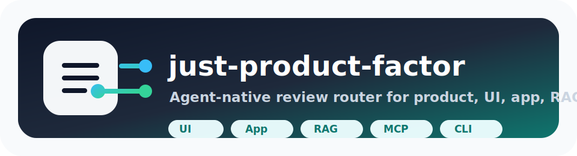
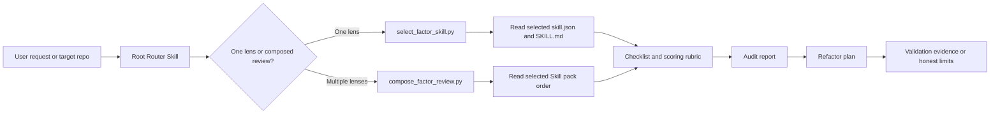

<div align="center">
  
  <h1>just-product-factor</h1>
  <p><strong>Turn engineering standards into reusable Agent Skills for repeatable product audits, refactors, and release checks.</strong></p>
  <p><strong>把优秀工程标准，变成 Agent 可以反复调用的产品优化技能。</strong></p>
  <p>
    <a href="https://github.com/Just-Agent/just-product-factor/actions/workflows/validate.yml"></a>
    <a href="https://github.com/Just-Agent/just-product-factor/releases/tag/v0.9.0"></a>
    <a href="./LICENSE"></a>
    
    
  </p>
  <p>
    <a href="./docs/generated-skill-catalog.md">Skill Catalog</a>
    |
    <a href="./SKILL.md">Router Skill</a>
    |
    <a href="./docs/agent-invocation-protocol.md">Agent Protocol</a>
    |
    <a href="./docs/multi-skill-composition-guide.md">Composition Guide</a>
    |
    <a href="./RELEASE_NOTES.md">Release Notes</a>
  </p>
</div>

`just-product-factor` is the public repository for the `product-factor-skills` pack: a lightweight, dependency-free router plus twelve Agent-callable Factor Skills for improving Agent systems, UI/frontends, apps, CLIs, RAG pipelines, MCP servers, GitHub Actions, documentation, security posture, observability, and product readiness.

It is not a heavy framework. It is a practical review system that turns a method into a repeatable working unit:

```text
engineering standard
  -> Agent-callable Skill
  -> checklist
  -> scoring rubric
  -> audit report
  -> refactor plan
  -> validation evidence
```

## 30-Second Start

Clone the repository and ask the router which Skill should lead a review:

```bash
git clone https://github.com/Just-Agent/just-product-factor.git
cd just-product-factor
python scripts/select_factor_skill.py "audit this React frontend dashboard for UI polish accessibility performance and app deployability" --root . --top 5
```

Expected route:

```text
Primary Skill: 10-factor-html
Secondary Skill: 12-factor-app
```

Generate a multi-Skill review plan:

```bash
python scripts/compose_factor_review.py "prepare this UI app for release with accessibility app deployability docs and observability" --root . --target ./examples/sample-agent-project --max-skills 5 --out ./tmp/composed-review
```

Expected result:

```text
10-factor-html
12-factor-app
8-factor-github-actions
6-factor-docs
15-factor-observability
```

## Router Preview

The root [`SKILL.md`](./SKILL.md) is the entrypoint. It decides whether a task should use one specific Skill or a composed review plan.

| User says | Primary route | Useful secondary routes |
|---|---|---|
| "Audit this React frontend dashboard UI" | [`10-factor-html`](./skills/10-factor-html) | [`12-factor-app`](./skills/12-factor-app), [`13-factor-product-readiness`](./skills/13-factor-product-readiness) |
| "Prepare this app for release" | [`12-factor-app`](./skills/12-factor-app) | [`8-factor-github-actions`](./skills/8-factor-github-actions), [`6-factor-docs`](./skills/6-factor-docs) |
| "Review this mobile onboarding flow" | [`13-factor-product-readiness`](./skills/13-factor-product-readiness) | [`10-factor-html`](./skills/10-factor-html), [`12-factor-app`](./skills/12-factor-app) |
| "Audit this RAG pipeline" | [`9-factor-rag`](./skills/9-factor-rag) | [`5-factor-evals`](./skills/5-factor-evals), [`12-factor-agents`](./skills/12-factor-agents) |
| "Review this MCP server schema and permissions" | [`7-factor-mcp`](./skills/7-factor-mcp) | [`14-factor-security-privacy`](./skills/14-factor-security-privacy), [`12-factor-agents`](./skills/12-factor-agents) |
| "Make this repo easier to debug in future Agent runs" | [`15-factor-observability`](./skills/15-factor-observability) | [`14-factor-security-privacy`](./skills/14-factor-security-privacy) |

## What You Get

| Capability | What it gives an Agent | Evidence in this repo |
|---|---|---|
| Skill selection | Pick the best review lens from a broad request | [`scripts/select_factor_skill.py`](./scripts/select_factor_skill.py) |
| Structured audits | Produce consistent reports and scorecards | [`templates/`](./templates) and [`skills/*/audit-report-template.md`](./skills) |
| Refactor planning | Convert findings into prioritized work | [`skills/*/refactor-plan-template.md`](./skills) |
| Multi-Skill reviews | Combine product, security, observability, and domain checks | [`scripts/compose_factor_review.py`](./scripts/compose_factor_review.py) |
| Prompt handoff | Render a full Skill pack into one copyable Agent prompt | [`scripts/render_skill_prompt.py`](./scripts/render_skill_prompt.py) |
| Release validation | Check structure, manifests, examples, and release artifacts | [`scripts/scan_factor_project.py`](./scripts/scan_factor_project.py) |
| README identity | Provide a stable visual anchor for the GitHub homepage | [`docs/readme-assets/just-product-factor.svg`](./docs/readme-assets/just-product-factor.svg) |

## Skill Map

| Area | Skill | Use it when |
|---|---|---|
| Agent systems | [`12-factor-agents`](./skills/12-factor-agents) | You are reviewing tools, prompts, memory, control flow, or human approval loops |
| App engineering | [`12-factor-app`](./skills/12-factor-app) | You need deployability, configuration, service design, and product engineering quality |
| Static web output | [`10-factor-html`](./skills/10-factor-html) | You need semantic HTML, responsive UI, accessibility, SEO, performance, or visual polish |
| CI/CD | [`8-factor-github-actions`](./skills/8-factor-github-actions) | You need safer, clearer, reusable GitHub Actions workflows |
| RAG | [`9-factor-rag`](./skills/9-factor-rag) | You need retrieval quality, chunking, indexing, citations, freshness, and evals |
| MCP | [`7-factor-mcp`](./skills/7-factor-mcp) | You need tool boundaries, schema clarity, permission design, and runtime safety |
| CLI products | [`11-factor-cli`](./skills/11-factor-cli) | You need installability, command UX, help output, scriptable output, and release readiness |
| Product launch | [`13-factor-product-readiness`](./skills/13-factor-product-readiness) | You need positioning, onboarding, examples, release discipline, and GitHub polish |
| Documentation | [`6-factor-docs`](./skills/6-factor-docs) | You need stronger README, guides, examples, accuracy, and Agent handoff prompts |
| Evaluation | [`5-factor-evals`](./skills/5-factor-evals) | You need golden cases, regression tests, failure taxonomy, benchmarks, and release gates |
| Security and privacy | [`14-factor-security-privacy`](./skills/14-factor-security-privacy) | You need secrets hygiene, permissions, data handling, dependency hygiene, and release blockers |
| Observability | [`15-factor-observability`](./skills/15-factor-observability) | You need logs, traces, metrics, validation artifacts, failure diagnostics, and handoff evidence |

## How Agents Use It



The full protocol is in [`docs/agent-invocation-protocol.md`](./docs/agent-invocation-protocol.md). For broader projects, use [`docs/multi-skill-routing-matrix.md`](./docs/multi-skill-routing-matrix.md) and [`docs/multi-skill-composition-guide.md`](./docs/multi-skill-composition-guide.md).

## Core Commands

| Task | Command |
|---|---|
| Validate repository structure | `python scripts/scan_factor_project.py .` |
| Route a UI/frontend task | `python scripts/select_factor_skill.py "audit this React frontend dashboard for UI polish accessibility performance and app deployability" --root . --top 5` |
| Route a RAG task | `python scripts/select_factor_skill.py "audit this RAG app for retrieval quality and regression tests" --root . --top 5` |
| Compose a UI/app release review | `python scripts/compose_factor_review.py "prepare this UI app for release with accessibility app deployability docs and observability" --root . --target ./examples/sample-agent-project --max-skills 5 --out ./tmp/composed-review` |
| Generate an audit workspace | `python scripts/run_skill_audit.py --repo . --target ./examples/sample-agent-project --skill 12-factor-agents --out ./tmp/agent-audit` |
| Render a one-shot prompt | `python scripts/render_skill_prompt.py 13-factor-product-readiness --target ./my-repo --out ./tmp/product-readiness-prompt.md` |
| Export the Skill catalog | `python scripts/export_skill_catalog.py . --markdown docs/generated-skill-catalog.md --json docs/generated-skill-catalog.json` |
| Create a new Skill skeleton | `python scripts/generate_factor_skill.py xx-factor-example --title "xx-factor-example" --category example` |
| Build a release zip | `python scripts/build_release_zip.py . --out ../product-factor-skills-$(cat VERSION).zip` |

## Repository Layout

```text
product-factor-skills/
  README.md
  SKILL.md
  VERSION
  product-factor-skills.json
  skills.json
  skills/
    12-factor-agents/
    12-factor-app/
    10-factor-html/
    8-factor-github-actions/
    9-factor-rag/
    7-factor-mcp/
    11-factor-cli/
    13-factor-product-readiness/
    6-factor-docs/
    5-factor-evals/
    14-factor-security-privacy/
    15-factor-observability/
  scripts/
  templates/
  docs/
  examples/
  guides/
  schemas/
  skill-factory/
```

## Output Contract

Every Skill is designed to help an Agent return concrete, reviewable artifacts:

- Summary of the target project and selected review lens.
- Scorecard grounded in checklist evidence.
- Critical findings ordered by risk and product value.
- Refactor plan with practical next actions.
- Validation summary that records what was run and what could not be verified.
- Decision log for tradeoffs, assumptions, and remaining risks.

See [`docs/output-contract.md`](./docs/output-contract.md) for the shared report shape.

## Skill Factory

Create a new Factor Skill skeleton:

```bash
python scripts/generate_factor_skill.py xx-factor-cli --title "xx-factor-cli" --category cli
```

Then update the registry files:

- [`product-factor-skills.json`](./product-factor-skills.json)
- [`skills.json`](./skills.json)
- [`docs/generated-skill-catalog.md`](./docs/generated-skill-catalog.md)
- [`docs/generated-skill-catalog.json`](./docs/generated-skill-catalog.json)

Use [`skill-factory/xx-factor-skill-template`](./skill-factory/xx-factor-skill-template) when you prefer to copy the template manually.

## Release Status

Current version: `v0.9.0`

`v0.9.0` adds `15-factor-observability`, a dependency-free multi-Skill composer, an observability playbook, a composed review template, and expanded validation for twelve bundled Skills.

Before publishing a new version:

1. Update [`VERSION`](./VERSION).
2. Update [`CHANGELOG.md`](./CHANGELOG.md), [`RELEASE_NOTES.md`](./RELEASE_NOTES.md), and [`logs/version-history.md`](./logs/version-history.md).
3. Run `python scripts/scan_factor_project.py .`.
4. Build and verify the release zip.

See [`docs/release-checklist.md`](./docs/release-checklist.md).

## Attribution

The `12-factor-agents` Skill is inspired by the HumanLayer [`12-factor-agents`](https://github.com/humanlayer/12-factor-agents) project. This repository does not include upstream images or upstream source code; it packages the general idea into an Agent-callable Skill format with checklists, scoring rubrics, refactor workflows, templates, and validation conventions.

See [`ATTRIBUTION.md`](./ATTRIBUTION.md) for the license posture.

## Contributing

Contributions are welcome when they make the Skill pack more usable, more accurate, or easier for Agents to apply consistently.

Good contribution types:

- New Factor Skills.
- Better checklists and scoring rubrics.
- Stronger audit or refactor templates.
- Real before/after examples.
- Validation scripts and release checks.
- Documentation improvements.

Read [`CONTRIBUTING.md`](./CONTRIBUTING.md) before adding a Skill.

## Discovery Keywords

Factor Skill, Agent-native, reusable standards, project audit, project refactor, engineering checklist, release readiness, deployability, maintainability, Skill Factory, repeatable optimization.

标准化审查、可复用 Skill、Agent 原生、项目重构、工程清单、发布就绪、可部署、可维护、可扩展、技能工厂、反复优化。

## License

MIT. See [`LICENSE`](./LICENSE).
